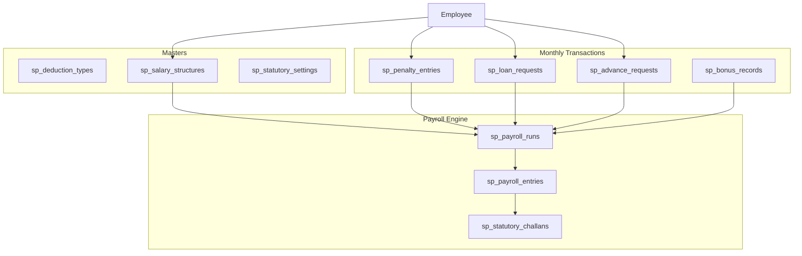
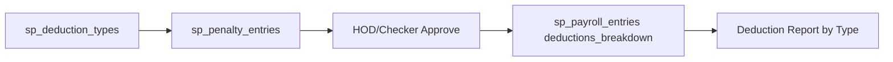

# New Salary Payroll Module Plan

## Context

Your project already has a full **attendance-driven payroll** under `Payroll Management` ([`app/Models/PayrollRun.php`](app/Models/PayrollRun.php), biometric attendance, monthly incentives, advances on `employee_advances`). You want a **new, separate module** that keeps the **earning/deduction concept** but does **not reuse** old payroll runs, salary components, or advance tables.

**Reuse (read-only link):** [`Employee`](app/Models/Employee.php), [`Branch`](app/Models/Branch.php), [`Department`](app/Models/Department.php), [`User`](app/Models/User.php)

**Do not touch:** `payroll_runs`, `payroll_entries`, `employee_salaries`, `salary_components`, `employee_advances`, existing `PayrollRun::processEmployeePayroll()`

---

## Architecture Overview



**Namespace prefix:** `sp_` (Salary Payroll) + routes `hr/salary-payroll/*` + sidebar group **"Salary Payroll"** (separate from existing **"Payroll Management"**).

---

## Business Rules (from your notes + forms)

### Salary structure (Gross-based split)
| Component | % of Gross |
|-----------|------------|
| Basic | 60% |
| LTA | 30% |
| HRA | 10% |

Example (Gross ₹35,000): Basic ₹21,000 | LTA ₹10,500 | HRA ₹3,500

> **Note:** One notebook page shows HRA 30% + Other 10%. Plan uses your text (LTA 30%, HRA 10%) but stores percentages in `sp_salary_structures` so branch/employee-type overrides are possible later.

### Statutory (CTC model from notebook)
| Item | Employee | Employer |
|------|----------|----------|
| PF | 12% on PF wages (cap ₹15,000 → max ₹1,800) | 13% (8.33% pension + 3.67% PF + 1% admin) |
| ESI | 0.75% on gross (ceiling ₹21,000) | 3.25% |
| Professional Tax | ₹200 if total earnings > ₹12,000 | — |
| Bonus (CTC component) | — | 8.33% of basic (employer cost) |
| Gratuity (CTC component) | — | ~4.81% of basic (15/26 days formula) |

**CTC** = Gross + Employer PF + Employer ESI + Bonus + Gratuity

**Net Salary** = Gross − Employee PF − ESI − P.Tax − Penalties − Loan EMI − Advance recovery − Canteen/Colony (if enabled)

### VPF (Directors)
- Per-employee flag on `sp_employee_payroll_profiles`
- VPF calculated on **actual basic** (not capped PF wages)
- Directors: separate profile (`employee_category = director`) — no standard PF/bonus rules unless configured

### Employee types
| Type | Pay basis |
|------|-----------|
| Staff | Monthly CTC / gross (26-day pro-rata optional) |
| Worker | Per-day rate from gross ÷ working days |
| Contractor | Fixed monthly charges (canteen ₹50 unlimited, colony ₹2,200) |

---

## Module Breakdown

### Phase 1 — Foundation (build first)

#### 1. Deduction Master
**Table:** `sp_deduction_types`

| Field | Purpose |
|-------|---------|
| name, code | Late Coming, Sleeping Day, Sleeping Night, Split, Gate Other, Canteen, Colony, Laxmi Book, Other |
| category | `penalty` / `statutory` / `recovery` / `facility` |
| calculation_mode | `fixed_amount` / `per_day` / `per_incident` |
| default_amount | e.g. sleeping day rate |
| branch_id, status | branch-wise master |

**UI:** [`resources/js/pages/hr/salary-payroll/masters/deduction-types/index.tsx`](resources/js/pages/hr/salary-payroll/masters/deduction-types/index.tsx) — same CRUD pattern as [`incentive-types/index.tsx`](resources/js/pages/hr/masters/incentive-types/index.tsx)

Seed default types matching your Excel penalty register:
- Late Coming, Sleeping (Day), Sleeping (Night), Split, Tobacco at Gate, Yarn Damage, Dress Code, Lunch Late, Hospital, Other

#### 2. Employee Payroll Profile (new, separate from old salary)
**Table:** `sp_employee_payroll_profiles`

Links `employees.id` to:
- `employee_type` (staff/worker/contractor/director)
- `monthly_gross` or `daily_rate`
- `working_days` (default 26)
- PF/ESI/VPF flags, `vpf_percentage`, `pf_wage_override` (director fixed ₹50,000 note)
- `bonus_eligible`, `canteen_enabled`, `colony_enabled`
- salary split override (optional % for basic/lta/hra)

#### 3. Penalty Register (deduction entry)
**Table:** `sp_penalty_entries`

Matches your Excel **Penalty Register-MAY 2026** structure:
- `branch_id`, `department_id`, `hod_user_id`
- `employee_id`, `penalty_date`, `sp_deduction_type_id`
- `amount`, `remarks`, `month_year`
- `status`: draft → approved → posted

**UI:** Department/HOD-wise monthly sheet (like Excel tabs: SANDIP BHAI, SUBODH JI, etc.) with totals row.

**Reports:** Separate deduction report by type, department, branch (as per notebook: "deduction Reports - Alg se").

---

### Phase 2 — Loan & Advance (your DOC/XLSX forms)

Both reference files contain the same **ADVANCE / LOAN FORM** (Kiran Industries letterhead with guarantors, dept head, accounts, HR, director sign).

#### 4. Loan Module
**Tables:** `sp_loan_requests`, `sp_loan_guarantors`, `sp_loan_installments`

| Rule | Validation |
|------|------------|
| Max amount | ≤ 1 month gross salary |
| Frequency | Max 2 active loans per employee per calendar year |
| Tenure | Max 6 months |
| Installments | Flexible (default 3), stored in `installment_count` |
| Workflow | `draft` → `dept_recommended` → `accounts_approved` → `director_approved` → `disbursed` → `recovering` → `closed` |

**Print:** Blade PDF matching [`ADVANCE FORMAT (1).DOC`](file:///c:/Users/X/Downloads/ADVANCE%20FORMAT%20(1).DOC) fields: employee, code, division, department, designation, present salary, purpose, amount (figure + words), 3 guarantors, applicant/dept head/accounts/HR/director signatures.

**Recovery:** EMI auto-deducted in `sp_payroll_entries` when payroll is processed.

#### 5. Advance Payment Module
**Table:** `sp_advance_requests`

| Rule | Validation |
|------|------------|
| Max amount | ≤ **earned salary till request date** (not full month) |
| Advance types | `type_20` (mid-month ~20th), `type_25` (month-end ~25th) |
| Double-count prevention | Once recovered in payroll, mark `recovered_in_payroll_id`; exclude from re-generation |

**Earned salary logic (example from notebook):**
```
earned = (monthly_gross / working_days) × present_days_till_date
allowed_advance = min(requested_amount, earned - already_taken_advances_this_month)
```

**Print:** Same form template as loan (shared Blade partial).

**Workflow:** Maker creates → Checker approves → Print → Disburse → Auto-deduct in month-end payroll.

---

### Phase 3 — Bonus, CTC & Payroll Generate

#### 6. Bonus Module
**Table:** `sp_bonus_records`

- Statutory **8.33%** on basic (employer CTC component)
- Rule from notebook: no bonus above salary ceiling (configurable in `sp_statutory_settings`)
- Can run annually or monthly accrual for CTC display
- Separate screen to view/calculate bonus per employee per FY

#### 7. Statutory Settings (branch + FY)
**Table:** `sp_statutory_settings`

Per branch / financial year:
- PF employee %, employer %, pension/admin split, max PF wage (₹15,000 default, ₹50,000 for directors)
- ESI employee/employer %, ceiling
- Bonus %, bonus max limit
- P.Tax slab (₹200 above ₹12,000)
- Canteen/colony rates by employee type (Worker ₹50/₹450, Staff ₹45/₹750, Contractor ₹2200)

#### 8. Payroll Run Engine (new)
**Tables:** `sp_payroll_runs`, `sp_payroll_entries`

**Run workflow (maker-checker):**
```
draft → calculated → in_review → approved → finalized
```

**Service:** `app/Services/SalaryPayroll/SalaryPayrollCalculator.php`

Calculation steps per employee:
1. Resolve gross (staff monthly / worker daily × days)
2. Split Basic 60%, LTA 30%, HRA 10%
3. Add approved bonus earnings if applicable
4. Deduct statutory: PF (12%), ESI (0.75%), P.Tax
5. Add VPF if director flag set
6. Pull approved `sp_penalty_entries` for month
7. Recover loan EMI + advance (FIFO, same pattern as existing [`EmployeeAdvance`](app/Models/EmployeeAdvance.php) but on new tables)
8. Add canteen/colony if enabled
9. Compute employer contributions + CTC
10. Store JSON `earnings_breakdown`, `deductions_breakdown`, `employer_contributions`, `ctc`

**Scope:** Branch + optional department filter (notebook: "Palti Kohi department ko salary Generate")

**UI:** Wizard similar to [`PayrollRunWizard.tsx`](resources/js/pages/hr/payroll-runs/components/PayrollRunWizard.tsx) but under new routes.

---

### Phase 4 — Challan & Reports

#### 9. PF / ESI Challan
**Table:** `sp_statutory_challans`

Aggregate from finalized `sp_payroll_entries` by branch + month:

**PF Challan breakdown (from notebook):**
- Employee share 12%
- Employer: 8.33% pension + 3.67% PF + 1% admin

**ESI Challan:**
- Employee 0.75% + Employer 3.25%

**Exports:** PDF + Excel, branch-wise, employee-wise annexure.

#### 10. Reports (new section under Salary Payroll)
| Report | Source |
|--------|--------|
| Penalty / Deduction Register | `sp_penalty_entries` |
| Salary Register | `sp_payroll_entries` |
| CTC Statement | earnings + employer contributions |
| Loan Ledger | `sp_loan_requests` + installments |
| Advance Ledger | `sp_advance_requests` |
| PF Challan | `sp_statutory_challans` |
| ESI Challan | `sp_statutory_challans` |
| Branch-wise summary | grouped runs |

---

## File / Code Structure (new files only)

```
app/
├── Models/SalaryPayroll/
│   ├── SpDeductionType.php
│   ├── SpEmployeePayrollProfile.php
│   ├── SpPenaltyEntry.php
│   ├── SpLoanRequest.php
│   ├── SpAdvanceRequest.php
│   ├── SpBonusRecord.php
│   ├── SpPayrollRun.php
│   ├── SpPayrollEntry.php
│   └── SpStatutoryChallan.php
├── Services/SalaryPayroll/
│   ├── SalaryPayrollCalculator.php
│   ├── EarnedSalaryService.php      # advance cap logic
│   ├── LoanValidationService.php
│   ├── CtcCalculator.php
│   └── ChallanAggregator.php
├── Http/Controllers/SalaryPayroll/
│   ├── SpDeductionTypeController.php
│   ├── SpPenaltyEntryController.php
│   ├── SpLoanRequestController.php
│   ├── SpAdvanceRequestController.php
│   ├── SpBonusController.php
│   ├── SpPayrollRunController.php
│   ├── SpEmployeeProfileController.php
│   └── SpChallanController.php
resources/js/pages/hr/salary-payroll/
├── masters/deduction-types/
├── employee-profiles/
├── penalty-register/
├── loans/
├── advances/
├── bonus/
├── payroll-runs/
└── challans/
resources/views/salary-payroll/
├── loan-advance-form.blade.php    # shared print from DOC
├── pf-challan.blade.php
└── esi-challan.blade.php
database/migrations/
└── 2026_06_*_create_sp_*_tables.php
```

---

## Routes, Permissions, Menu

**Routes** in [`routes/web.php`](routes/web.php):
```php
Route::prefix('salary-payroll')->name('hr.salary-payroll.')->group(function () {
    // deduction-types, penalty-entries, loans, advances, bonus,
    // employee-profiles, payroll-runs, challans
});
```

**Permissions** (add to [`LiveDeploySeeder`](database/seeders/LiveDeploySeeder.php)):
- `manage-sp-deduction-types`, `manage-sp-penalty-entries`, `manage-sp-loans`, `manage-sp-advances`
- `manage-sp-payroll-runs`, `approve-sp-payroll-runs`
- `manage-sp-challans`, `view-sp-reports`

**Sidebar** in [`app-sidebar.tsx`](resources/js/components/app-sidebar.tsx): new top-level **"Salary Payroll"** group (do not modify existing Payroll Management items).

---

## Deduction Module Design (your specific question)

How penalty deductions will work:



| Type | Entry mode | Example |
|------|------------|---------|
| Late Coming | per_incident or per_day | Supervisor enters date + employee |
| Sleeping Day | per_incident | Day shift penalty |
| Sleeping Night | per_incident | Night shift penalty (separate rate in master) |
| Split | per_incident | Split-shift violation |
| Gate / Other | per_incident | Tobacco at gate, unauthorized movement — category `gate_other` |
| Canteen / Colony | auto_monthly | Fixed from employee type in statutory settings |
| Laxmi Book | amount | Manual adjustment |

Gate vs khata (account) deductions stay **separate categories** in master so reports can filter them independently (notebook: "khate pe pa jate alg hai gate me alg").

---

## Implementation Order (recommended phases)

| Phase | Deliverable | Est. effort |
|-------|-------------|-------------|
| **1** | Migrations + Deduction Master + Employee Payroll Profile + Penalty Register + permissions/menu | 1 week |
| **2** | Loan + Advance modules with approval workflow + print PDF | 1 week |
| **3** | Statutory settings + Payroll Run calculator + maker-checker | 1.5 weeks |
| **4** | Bonus + CTC view + PF/ESI challan + branch reports | 1 week |

---

## Key Decisions Already Made

1. **Separate module** — new `sp_*` tables; old payroll untouched
2. **Employee master reused** — no duplicate employee records
3. **Salary split** — Basic 60%, LTA 30%, HRA 10% (configurable per profile)
4. **Approval** — per-module maker-checker (same pattern as [`LeaveApplicationController`](app/Http/Controllers/LeaveApplicationController.php))
5. **Branch-wise** — all transactional tables include `branch_id`; filtered by `session('active_branch_id')`
6. **Print formats** — loan/advance use your DOC template; challan uses PF breakdown from notebook

---

## Risks / Notes

- **Two payroll systems coexist** — clearly label menus ("Payroll Management" vs "Salary Payroll") to avoid user confusion
- **Employee ID convention** — follow existing pattern: payroll tables use `users.id` for employee_id (consistent with [`EmployeeAdvance`](app/Models/EmployeeAdvance.php)); penalty register can use `employees.id` internally but store `user_id` for payroll join
- **Attendance integration** — Phase 3 can optionally read [`biometric_attendances`](app/Models/BiometricAttendance.php) for worker daily pay and earned-salary calculation; not required for Phase 1 staff CTC payroll
- **Bonus % in old settings** — old `payroll_parameters.bonus_pct` defaults to 3%; new module will use **8.33%** per your notebook in `sp_statutory_settings`
