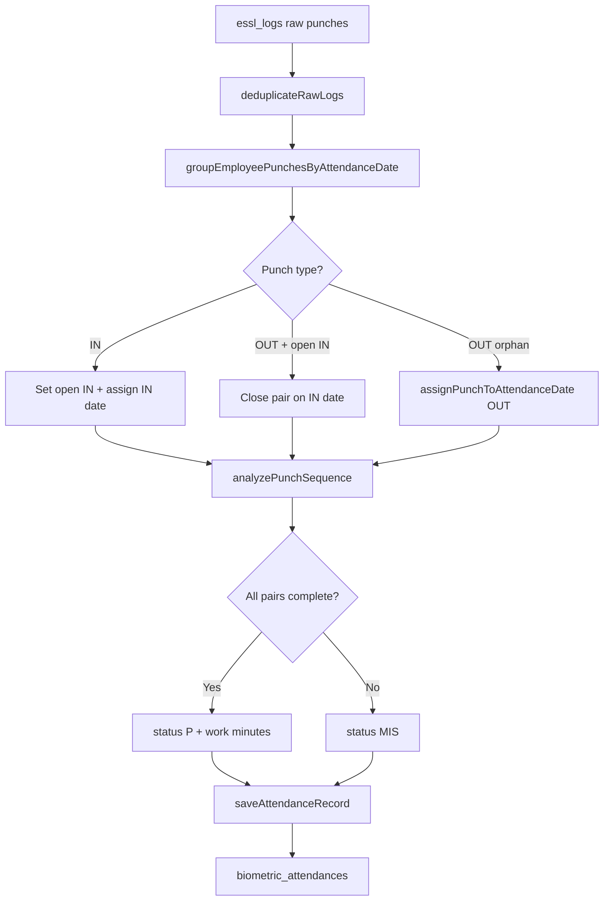

# Biometric Attendance Sync Engine — Complete Logic Report

**Version:** June 2026  
**Scope:** Shift handling, multi-shift, night shift, mispunch, `log_details`, work time, sync flow  
**Primary files:**
- `app/Http/Controllers/BiometricAttendanceSyncController.php`
- `app/Helpers/helper.php`
- `app/Traits/AttendanceProcessor.php`
- `resources/js/lib/attendance-punches.ts`
- `resources/js/pages/hr/attendance/sync.tsx`

---

## 1. Overview

The Attendance Sync Engine reads raw biometric device logs (`essl_logs`) and converts them into daily attendance records (`biometric_attendances`).

**Core principles (current code):**

| Rule | Description |
|------|-------------|
| No punch skipping | Every device punch appears in `log_details` |
| Sequential pairing | Punches paired IN → OUT in time order |
| Shift-aware dates | Night OUT on next calendar day belongs to IN date |
| Exact dedupe only | Same direction + same minute = one punch (duplicate device hit) |
| Mispunch (MIS) | Any incomplete IN/OUT pair OR IN count ≠ OUT count |
| Work minutes | Sum of **complete pairs only** (gaps between pairs excluded) |

---

## 2. Shift Types

### 2.1 Single Shift (Day)
Example: `08:00 – 18:00`  
- IN and OUT on same calendar date  
- `attendance_date` = punch calendar date  

### 2.2 Night Shift (crosses midnight)
Example: `20:00 – 08:00 (next day)`  
- IN at 20:18 on **01 Jun** → `attendance_date = 01 Jun`  
- OUT at 07:51 on **02 Jun** → paired with IN → still **01 Jun** record  

### 2.3 Multi-Shift (Day + Night)
Example employee shift **MULTI SHIFT** (`is_multi = 1`):

| Slot | Time | Type |
|------|------|------|
| Day | 08:00 – 20:00 | Same calendar day |
| Night | 20:00 – 08:00 | IN on day D, OUT on D+1 morning/afternoon |

**Code:** `getEmployeeDayAndNightSlots()` in `helper.php`  
- Slot where `start_time >= end_time` → **night slot**  
- Other slot → **day slot**

---

## 3. Sync Pipeline (Step by Step)

```
Device Logs (essl_logs)
        ↓
[1] Fetch logs: from_date − 1 day  →  to_date + 1 day
        ↓
[2] deduplicateRawLogs() — exact same minute + direction removed
        ↓
[3] groupEmployeePunchesByAttendanceDate() — sequential IN→OUT pairing
        ↓
[4] Filter by sync from_date … to_date
        ↓
[5] analyzePunchSequence() — log_details, work minutes, MIS flag
        ↓
[6] saveAttendanceRecord() — status, duty, OT, DB save
```

### Step 1 — Log fetch window
**File:** `BiometricAttendanceSyncController::performRunSync()`

```php
$logFetchFrom = $fromDate->copy()->subDay();  // night shift previous day IN
$logFetchTo   = $toDate->copy()->addDay();    // next day morning OUT
// Month-end: extend through next day 20:00 for night OUT (e.g. 1 Jun 07:56 closes 31 May)
if ($toDate->isLastOfMonth()) {
    $logFetchTo = $toDate->copy()->addDay()->setTime(20, 0, 0);
}
```

**Why:** Night shift IN on 24 Apr + OUT on 25 Apr 07:00 must both be fetched when syncing 24 Apr.  
**Month-end:** IN on **31 May 20:02** + OUT on **1 Jun 07:56** must pair on **31 May** — OUT lives in `DeviceLogs_6_YYYY` table.

### Step 1b — ESSL device import across month tables
**File:** `EsslSyncCommand` + `EsslService::resolveDeviceLogsTable()`

ESSL stores logs in monthly tables: `DeviceLogs_5_2026`, `DeviceLogs_6_2026`, etc.

| Boundary | Extra import |
|----------|----------------|
| **Month end** (syncing May) | Also pull **1st of next month 00:00–20:00** from `DeviceLogs_{next month}` (night OUT) |
| **Month start** (syncing June) | Also pull **last day 20:00–23:59** from previous month table (night IN) |

**Example (User 693):**
```
31 May 20:02 IN  → DeviceLogs_5_2026
01 Jun 07:56 OUT → DeviceLogs_6_2026  ← imported via month-end boundary fetch
Attendance date  = 31 May
log_details      = 20:02 IN, 07:56 OUT
```

### Step 2 — Dedupe
**File:** `BiometricAttendanceSyncController::deduplicateRawLogs()`

Removes only **exact duplicates**:
- `07:54 IN` + `07:54 IN` (same minute) → keep one  
- `10:51 OUT` + `18:36 OUT` → **both kept** (different times)

### Step 3 — Group by attendance date
**File:** `helper.php` → `groupEmployeePunchesByAttendanceDate()`

```
Chronological walk:
  IN  → start / continue open pair (assign date from IN)
  OUT → if open IN exists: close pair on IN's date
        else: orphan OUT → assignPunchToAttendanceDate(out)
  End → flush open IN as orphan
```

### Step 4 — Analyze
**File:** `helper.php` → `analyzePunchSequence()`

Outputs:
- `log_details` — e.g. `07:49 IN, 08:59 IN, 10:27 OUT, 21:19 IN, 13:30 OUT`
- `in_count`, `out_count`
- `work_minutes`
- `is_mis_punch`
- `first_in`, `last_out`

### Step 5 — Save
**File:** `AttendanceProcessor::saveAttendanceRecord()`

- `in_time` = first IN of the day  
- `out_time` = last OUT (adds +1 day if OUT clock ≤ IN clock for night)  
- `status` = `MIS` if mispunch, else `P` / `HD` / `A` from duty rules  
- `log_details` stored as-is (no collapsing)

---

## 4. Attendance Date Assignment Rules

**Function:** `assignPunchToAttendanceDate($employee, $punchTime, $direction)`

### 4.1 Day slot (08:00 – 20:00)

| Direction | Time window | attendance_date |
|-----------|-------------|-----------------|
| IN | 06:00 – 20:00 (2h grace before 08:00) | Calendar date |
| OUT | 08:00 – 20:00 | Calendar date |

### 4.2 Night slot (20:00 – 08:00)

| Direction | Time | attendance_date |
|-----------|------|-----------------|
| IN | ≥ 20:00 | Calendar date of IN |
| OUT | < 08:00 (morning) | **Previous calendar day** |
| OUT | 08:00 – 20:00 (late OUT, orphan) | **Previous calendar day** |

### 4.3 Paired punches (important)
When OUT follows IN in sequence, **both go to IN's date** — no separate date rule for paired OUT.

This is how **25 Apr 21:19 IN + 26 Apr 13:30 OUT** both land on **25 Apr**.

### 4.4 Multi-shift orphan OUT priority
When employee has **both** day and night slots, orphan OUT between **08:00–20:00** is assigned to the **previous calendar day** *before* the day-slot OUT rule runs. This prevents a late night-shift OUT (e.g. **13:31 on 26 Apr**) from incorrectly staying on 26 Apr when it belongs to **25 Apr** duty.

---

## 5. `log_details` Format

**Format:** `HH:MM IN, HH:MM OUT, HH:MM IN, ...`  
**Example:** `07:49 IN, 08:59 IN, 10:27 OUT, 19:45 IN, 20:06 OUT, 21:19 IN, 13:30 OUT`

| Field | Source |
|-------|--------|
| Full Logs (UI) | All events from `log_details` |
| Edit modal pairs | `parseLogDetailsToPairs()` — sequential IN→OUT |
| PDF mispunch report | `buildMispunchReportRowFromRecord()` |

**Frontend:** `resources/js/lib/attendance-punches.ts`  
- `dedupeExactPunchEvents()` — only exact minute duplicates removed  
- Consecutive OUTs **not** collapsed (e.g. `10:51 OUT, 18:36 OUT` = 2 pairs)

---

## 6. Mispunch (MIS) Logic

### 6.1 When status = MIS

**PHP:** `analyzePunchSequence()` + `AttendanceProcessor`

| Condition | MIS? |
|-----------|------|
| OUT without prior IN | Yes |
| IN without following OUT | Yes |
| Two IN in a row (first IN unclosed) | Yes |
| `in_count !== out_count` | Yes |
| All pairs complete, counts equal | No → can be `P` |

### 6.2 Work minutes on MIS day

Only **complete pairs** count:

```
Pair 1: 07:49 IN → (no OUT)     = 0 min
Pair 2: 08:59 IN → 10:27 OUT    = 88 min
Pair 3: 19:45 IN → 20:06 OUT    = 21 min
Pair 4: 21:19 IN → 13:30 OUT    = 971 min (cross-day)
Total work_minutes              = 1080 min
```

Gaps (e.g. 10:27 – 19:45) are **not** counted as work.

### 6.3 UI modal pairs (Edit)

| Pair | Display |
|------|---------|
| Complete | `IN` + `OUT` filled |
| Missing OUT | `IN` filled, `OUT` empty |
| Missing IN (orphan OUT) | `IN` empty, `OUT` filled |

**Frontend:** `hasMispunchIssues()`, `getMispunchIssues()` in `attendance-punches.ts`

---

## 7. Cross-Day Open IN (No 24-Hour Grace)

### 7.1 Rules (implemented — shift session)

| Rule | Behaviour |
|------|-----------|
| **Rule 1** | Last punch is IN → next chronological punch must be **OUT** (may be next calendar morning). That OUT closes the IN on the **shift day**. |
| **Rule 2** | Next punch after open IN is **IN** (no OUT) → previous open IN stays **unpaired** → **MIS**. |
| **Rule 3 (defer)** | Open IN is **not MIS** until `getShiftSessionEnd()` (e.g. next day 20:00 for night / multi). Day-only: defer while `attendance_date` is today. |

**Shift session helpers:** `resolveShiftAttendanceDate()`, `getShiftSessionStart()`, `getShiftSessionEnd()`, `getShiftAttendanceDateForPunch()`.

**Sync:** `groupEmployeePunchesByAttendanceDate()` buckets by shift day; pairs IN→OUT in time order.  
**Reports:** `enrichMispunchPairsForRecord()` + `fetchFirstPunchAfterOpenIn()`.

### 7.2 Examples

| Scenario | Punches | Result |
|----------|---------|--------|
| A | 2 Jun IN 08:00, OUT 18:00, IN 19:00 → 3 Jun OUT 07:00 | Pair 2 closed by 07:00 OUT — **not MIS** |
| B | 2 Jun IN 19:00 → 3 Jun IN 08:00 (no OUT first) | 19:00 IN **MIS**; 08:00 IN new cycle |

---

## 8. Real Examples (From Production Cases)

### Example 1 — Duplicate IN (Employee 413 / SURAJ)

**Raw logs:**
```
07:54 IN
07:54 IN  ← duplicate (removed)
19:44 OUT
```

**After sync:**
```
log_details: 07:54 IN, 19:44 OUT
status: P
in_count: 1, out_count: 1
```

**Code:** `deduplicateRawLogs()` removes second `07:54 IN`.

---

### Example 2 — Night shift (Employee 452)

**Raw logs:**
```
01 Jun 20:18 IN
02 Jun 07:51 OUT
```

**After sync (attendance_date = 01 Jun):**
```
log_details: 20:18 IN, 07:51 OUT
work_minutes: ~633
status: P
```

**Code:** `groupEmployeePunchesByAttendanceDate()` pairs OUT with IN on IN date.

---

### Example 3 — Multi-shift full day (Employee 20204 — 25 Apr 2026)

**Raw logs:**
```
25 Apr 07:49 IN
25 Apr 08:59 IN
25 Apr 10:27 OUT
25 Apr 19:45 IN
25 Apr 20:06 OUT
25 Apr 21:19 IN   ← night shift start
26 Apr 13:30 OUT  ← closes 25 Apr night (multi-shift)
```

**After sync (attendance_date = 25 Apr):**
```
log_details: 07:49 IN, 08:59 IN, 10:27 OUT, 19:45 IN, 20:06 OUT, 21:19 IN, 13:30 OUT

Modal pairs:
  Pair 1: 07:49 IN / (missing OUT)  ← MIS
  Pair 2: 08:59 IN / 10:27 OUT
  Pair 3: 19:45 IN / 20:06 OUT
  Pair 4: 21:19 IN / 13:30 OUT      ← night multi-shift

status: MIS (because pair 1 incomplete)
work_minutes: ~1080 (complete pairs only)
first_in: 07:49
last_out: 13:30 (26 Apr timestamp stored)
```

**Key logic:** `21:19 IN` + `26 Apr 13:30 OUT` = one pair on **25 Apr** (rat ko IN, agle din OUT = same shift day).

---

### Example 4 — Orphan OUT (no IN)

**Raw logs:**
```
30 Apr 07:52 IN
30 Apr 10:51 OUT
30 Apr 18:36 OUT  ← no IN before this
```

**After sync:**
```
log_details: 07:52 IN, 10:51 OUT, 18:36 OUT

Modal pairs:
  Pair 1: 07:52 IN / 10:51 OUT
  Pair 2: (missing IN) / 18:36 OUT  ← MIS

status: MIS
```

**Code:** `parseLogDetailsToPairs()` — consecutive OUTs not merged.

---

### Example 5 — Double shift same day

**Raw logs:**
```
08:00 IN → 14:00 OUT   (day slot)
20:00 IN → 07:00 OUT   (night slot, next morning)
```

**Result on one attendance_date (if both IN dates same):**
```
log_details: 08:00 IN, 14:00 OUT, 20:00 IN, 07:00 OUT
isDoubleShift: true (if total minutes ≥ 1.6 × shift duration)
shift_code: "KD, KN" (both slot names)
duty: 2.0
```

**Code:** `AttendanceProcessor` → `$isDoubleShift` check.

---

## 9. Database Columns Saved

| Column | Meaning |
|--------|---------|
| `attendance_date` | Shift day (not always calendar punch date) |
| `in_time` | First IN datetime |
| `out_time` | Last OUT datetime (+1 day if night) |
| `in_count` | Total IN punches |
| `out_count` | Total OUT punches |
| `punch_count` | in_count + out_count |
| `log_details` | Full punch string |
| `total_minutes` | Work minutes (complete pairs) |
| `status` | P / MIS / HD / A |
| `late_in` | Minutes late vs shift start |
| `early_out` | Minutes early vs shift end |
| `ot_minutes` | Overtime after shift end |
| `duty_value` | 0 / 0.5 / 1 / 2 |
| `shift_code` | Detected slot code |
| `is_manual` | Manual edit protection |

---

## 10. Status & Duty Rules

**File:** `AttendanceProcessor::saveAttendanceRecord()`

| Status | When |
|--------|------|
| `MIS` | Mispunch detected |
| `P` | Present — duty rules matched |
| `HD` | Half day — 50–75% shift duration |
| `A` | Absent — below 50% |

**Double shift:** total work ≥ 160% of single shift duration → `duty = 2.0`, `status = P`.

**Manual records:** `is_manual = 1` → not overwritten by sync.

---

## 11. Frontend (Sync Page)

**File:** `resources/js/pages/hr/attendance/sync.tsx`

| Feature | Function |
|---------|----------|
| Full Logs badges | `getDisplayPunchEventsFromRecord()` |
| Edit modal multi-pair | `shouldUsePairEditor()` — MIS, multi-shift, >1 pair |
| Pair editor | `PunchPairsEditor` component |
| Save payload | `buildAttendancePayloadFromPairs()` |

---

## 12. Mispunch PDF Report

**Route:** `ReportController::mispunchFormPdf()`  
**Helper:** `buildMispunchReportRowFromRecord()`

Includes:
- Employee name, code, dept, date  
- All punch pairs from `log_details`  
- `is_multiple` flag for multi-pair days  

---

## 13. How to Re-Sync

1. Open **HR → Attendance Sync Engine**  
2. Set **from_date** = target date **minus 1 day** (for night shift)  
3. Set **to_date** = target date **plus 1 day** (for late OUT)  
4. Filter employee if needed  
5. Run sync  

**Example for 20204 on 25 Apr 2026:**
```
from_date: 24 Apr 2026
to_date:   26 Apr 2026
employee:  20204
```

**Example for month-end night shift (31 May IN → 1 Jun OUT):**
```
essl:sync --from=2026-05-31 --to=2026-05-31
attendance sync from_date: 2026-05-31  to_date: 2026-05-31
```
Device import automatically pulls **1 Jun 00:00–20:00** from `DeviceLogs_6_2026`.

---

## 14. Flow Diagram



---

## 15. Code Function Reference

| Function | File | Purpose |
|----------|------|---------|
| `performRunSync()` | BiometricAttendanceSyncController | Main sync loop |
| `deduplicateRawLogs()` | BiometricAttendanceSyncController | Exact minute dedupe |
| `groupEmployeePunchesByAttendanceDate()` | helper.php | Sequential pairing + date grouping |
| `assignPunchToAttendanceDate()` | helper.php | Shift slot date rules |
| `getEmployeeDayAndNightSlots()` | helper.php | Day/night slot split |
| `analyzePunchSequence()` | helper.php | log_details, MIS, work min |
| `sumWorkMinutesFromLogDetails()` | helper.php | Work time from log_details |
| `parseLogDetailsToPairs()` | helper.php + attendance-punches.ts | IN/OUT pairs |
| `buildMispunchReportRowFromRecord()` | helper.php | PDF row builder |
| `saveAttendanceRecord()` | AttendanceProcessor | DB save + duty/status |
| `hasMispunchIssues()` | attendance-punches.ts | UI mispunch check |

---

## 16. Summary Table — What Code Does vs Old Behavior

| Situation | Old behavior | Current behavior |
|-----------|--------------|------------------|
| Duplicate IN same minute | Sometimes double shown | Deduped — one kept |
| Duplicate OUT different times | Collapsed / skipped | Both shown in log_details |
| Night IN + next day OUT | Wrong date / MIS | Same attendance_date as IN |
| Late night OUT (13:30 next day) | Went to wrong date | Paired on IN date (25 Apr) |
| Multi IN/OUT same day | Only first/last saved | All punches in log_details |
| Orphan OUT | Skipped | Shown as missing IN pair |
| Work time gaps | Full span counted | Only complete pairs summed |
| Open IN no OUT | MIS immediately | MIS immediately *(24h grace pending)* |

---

## 17. Pending Enhancement

- [ ] **24-hour grace window** for open IN before marking MIS  
- [ ] Auto re-sync job after 24h for in-progress shifts  

---

*Report generated from current codebase — Attendance Sync Engine, Kiran HRM.*
